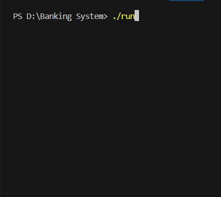

# 🏦 C++ Console Banking System

A simple console-based **Banking System** created as my **First Year Computer Engineering (Semester 1)** C++ project.  

---
## 🔥 Features

- Check balance  
- Deposit money  
- Withdraw money  
- Switch-case  
- Input validation  

---

## 🧠 Concepts Used

- Functions  
- Return values  
- Loops  
- Switch-case  
- Input validation  

---
## 🎥 Preview

